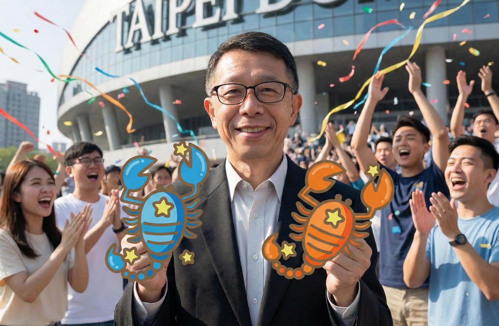

## 我的雙天蠍 Agent 實戰分工和省錢攻略

Clawdbot 正式更名為 **OpenClawd**，而我的 AI 團隊也迎來了新編制。

為了避免多個 AI Agent 在背景爭功或吵架，我正式將兩位助理命名為：
*   **天蠍一號 (Scorpio I)**：橘色蠍子，駐紮在我的主力工作機，負責高效能運算。
*   **天蠍二號 (Scorpio II)**：藍色蠍子，棲身於 2014 年的老 Mac mini 備份機，負責日常指令與備份。

為了讓它們乖乖聽話，我制定了嚴格的 **遊戲規則**：預設由「二號」回應指令，「一號」保持靜默，除非被特別點名。其實主要的目的是為了 **分散資源** 和 **控制成本**。

## 代理型 AI 的成本難題：如何用 Token 換算最大效益？

不同於 Gemini Web 的月費吃到飽模式，**OpenClawd (Agent)** 是按 Token 計費的。每一次「思考」和「執行」都在燒錢。

為了找出 **CP 值最高** 的工作模式，我質問了天蠍一號：「如何讓你既聰明又省錢？」

它的回答不僅誠實，還給出了一套完美的 **黃金分工法則**：

### 1. Gemini Web = 智慧大腦 (Brain)
*   **角色**：創意總監、策略顧問。
*   **任務**：負責所有需要大量動腦、產生長文章和發想創意的工作。
*   **優勢**：吃到飽不加價，盡情壓榨它的算力。

### 2. OpenClawd = 精準執行者 (Hands)
*   **角色**：操作員和執行秘書。
*   **任務**：負責動手執行、與系統環境互動 (開啟網頁、點擊和存檔)。
*   **優勢**：精準和直接，只在需要行動時才消耗 Token，絕不廢話。

**結論**：讓 Gemini 去構想，讓 OpenClawd 去執行。這就是讓每一分錢都花在刀口上的秘密。

## 進階玩法：叫 OpenClawd 去「指揮」Gemini

既然分工明確，那能不能讓 OpenClawd 自動去操作 Gemini Web，達成全自動化？答案是肯定的，天蠍一號給出了具體的三步走方案：

1. **建立自動化腳本 (Browser Automation)**：使用 Clawdbot 的 `browser` 工具在 Gemini Web 介面上自動執行操作。
2. **解決登入問題 (Browser Relay)**：在 Chrome 瀏覽器中安裝 Clawdbot Browser Relay 擴充功能，並登入 Gemini，天蠍一號就可以使用這個工具來控制已登入的瀏覽器頁面。
3. **定期排程 (Cron Tool)**：寫好 Prompt，設定 `cron` 定時任務。讓天蠍一號每天自動去「喚醒」Gemini 幫我寫摘要和跑報表。

這就是代理型 AI Agent 的真諦：它不只是聊天機器人，它也是你的 **數位代理人**。

## 關於隱私：Google 的雙重標準？

大家最關心的隱私問題，天蠍一號也給出了它的理解（雖然它是 Google 家的孩子）：

*   **API 模式 (OpenClawd)**：資料 **預設不參與訓練**。企業級的隱私保護，相對安全。
*   **Web 模式 (Gemini web)**：Google 可能會有不同的資料使用條款，應該查閱其特定的隱私權政策。

所以，較機密的任務走 API，需要大量思考的任務走 Gemini Web，這也是一種風險分散。

## 結語：沒有「幸福快樂的日子」，只有不斷磨合

坊間關於 OpenClawd 的神話很多，彷彿有了 AI 就能躺平。但現實是，AI 偶爾也會「幻覺」，腳本偶爾也會報錯。它像是聰明的小孩，經常會給你意想不到的驚喜，但也需要你的耐心和引導。

我了解使用 AI 之後不會變成童話故事，幸福快樂的日子需要 **持續的磨合 (Calibration)**。只有當我們學會了如何指揮大腦 (Gemini) 與手腳 (OpenClawd)，以及與 AI 共同作業，AI 才會從單純的「工具」，進化成我們不可或缺的「戰友」。
